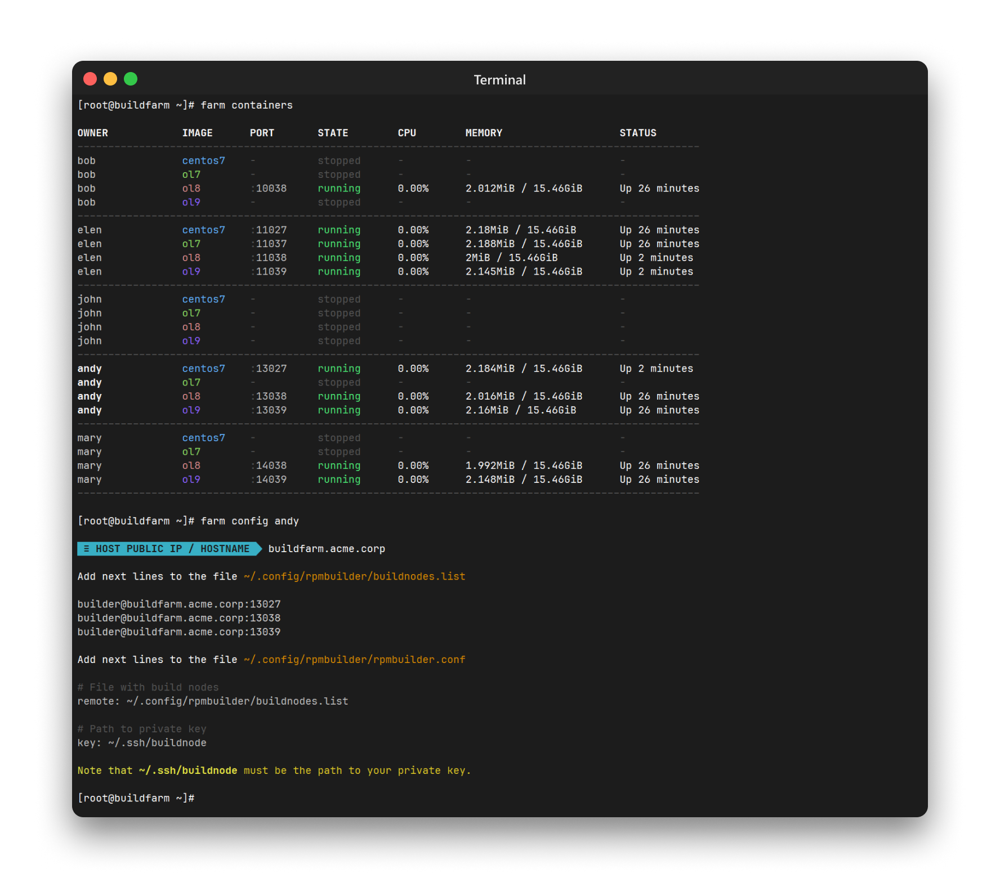

<p align="center"><a href="#readme"></a></p>

<p align="center">
  <a href="https://kaos.sh/w/rpmbuilder/ci"></a>
  <a href="#license"></a>
</p>

<p align="center"><a href="#usage-demo">Usage demo</a> • <a href="#installation">Installation</a> • <a href="#tips">Tips</a> • <a href="#usage">Usage</a> • <a href="#build-status">Build Status</a> • <a href="#contributing">Contributing</a> • <a href="#license">License</a></p>

<br/>

`rpmbuilder` is RPM package build helper.

### Usage demo

https://github.com/essentialkaos/rpmbuilder/assets/182020/d0ae6d9c-663e-46cf-a3f3-2c0fa25c97a3

### Installation

#### From [ESSENTIAL KAOS Public Repository](https://kaos.sh/kaos-repo)

```bash
sudo yum install -y https://pkgs.kaos.st/kaos-repo-latest.el$(grep 'CPE_NAME' /etc/os-release | tr -d '"' | cut -d':' -f5).noarch.rpm
sudo yum install rpmbuilder
```

Build node:

```bash
sudo yum install -y https://pkgs.kaos.st/kaos-repo-latest.el$(grep 'CPE_NAME' /etc/os-release | tr -d '"' | cut -d':' -f5).noarch.rpm
sudo yum install rpmbuilder-node
```

#### Using Makefile and Git

```bash
git clone https://kaos.sh/rpmbuilder.git
cd rpmbuilder
sudo make install
```

#### Using Docker

We provide a big variety of Docker images available on [GitHub Container Registry](https://kaos.sh/p/rpmbuilder) and [Docker Hub](http://kaos.sh/d/rpmbuilder).

<details><summary><b>Official images</b></summary><p>

Basic images:

- `ghcr.io/essentialkaos/rpmbuilder:centos7` (_CentOS 7_)
- `ghcr.io/essentialkaos/rpmbuilder:ol7` (_OracleLinux 7_)
- `ghcr.io/essentialkaos/rpmbuilder:ol8` (_OracleLinux 8_)
- `ghcr.io/essentialkaos/rpmbuilder:ol9` (_OracleLinux 9_)
- `essentialkaos/rpmbuilder:centos7` (_CentOS 7_)
- `essentialkaos/rpmbuilder:ol7` (_OracleLinux 7_)
- `essentialkaos/rpmbuilder:ol8` (_OracleLinux 8_)
- `essentialkaos/rpmbuilder:ol9` (_OracleLinux 9_)

Build node images:

- `ghcr.io/essentialkaos/rpmbuilder:node-centos7` (_CentOS 7_ | Port: `2027`)
- `ghcr.io/essentialkaos/rpmbuilder:node-ol7` (_OracleLinux 7_ | Port: `2037`)
- `ghcr.io/essentialkaos/rpmbuilder:node-ol8` (_OracleLinux 8_ | Port: `2038`)
- `ghcr.io/essentialkaos/rpmbuilder:node-ol9` (_OracleLinux 9_ | Port: `2039`)
- `essentialkaos/rpmbuilder:node-centos7` (_CentOS 7_ | Port: `2027`)
- `essentialkaos/rpmbuilder:node-ol7` (_OracleLinux 7_ | Port: `2037`)
- `essentialkaos/rpmbuilder:node-ol8` (_OracleLinux 8_ | Port: `2038`)
- `essentialkaos/rpmbuilder:node-ol9` (_OracleLinux 9_ | Port: `2039`)

</p></details>

Package build using base image:

```bash
# Download and install rpmbuilder-docker script
curl -fL# -o rpmbuilder-docker https://kaos.sh/rpmbuilder/rpmbuilder-docker
chmod +x rpmbuilder-docker
sudo mv rpmbuilder-docker /usr/bin/

# Pull rpmbuilder image based on OracleLinux 8
docker pull ghcr.io/essentialkaos/rpmbuilder:ol8
export IMAGE=ghcr.io/essentialkaos/rpmbuilder:ol8

# Build package locally
cd my-package-dir
rpmbuilder-docker my-package.spec

# Build package using build nodes
rpmbuilder-docker my-package.spec -r buildnode-ol7.acme.corp:2022 -r buildnode-ol8.acme.corp:2022 -k $(base64 -w0 ~/.ssh/buildnode)
```

Package build using build node image:

```bash
docker pull ghcr.io/essentialkaos/rpmbuilder:node-ol8
docker run -e PUB_KEY="$(cat ~/.ssh/buildnode.pub)" -p 2038:2038 -d ghcr.io/essentialkaos/rpmbuilder:node-ol8

cd my-package-dir

# Using local version of rpmbuilder (if you are use RHEL, Alma, Rocky, CentOS…)
rpmbuilder my-package.spec -r builder@localhost:2038 -k ~/.ssh/buildnode

# With docker helper script (any Linux distro or macOS)
rpmbuilder-docker my-package.spec -r builder@localhost:2038 -k $(base64 -w0 ~/.ssh/buildnode)
```

You can bootstrap your own build farm using Docker and `rpmbuilder-farm` script:

```bash
curl -fL# -o rpmbuilder-farm https://kaos.sh/rpmbuilder/rpmbuilder-farm
chmod +x rpmbuilder-farm
sudo mv rpmbuilder-farm /usr/bin/

# Install farm script
sudo rpmbuilder-farm install

# Create user bob and add public key
sudo farm add-user bob

# Start all containers for user bob
sudo farm start bob
```

<p align="center"></p>

### Tips

* You could define rpmbuilder options inside your specs ([example](https://github.com/essentialkaos/kaos-repo/blob/develop/specs/libnut/libnut.spec#L3-L4)). It very helpful for determining information about external sources.
* If you have a big bunch of default options, you can define them in the preferences file. [More info](https://github.com/essentialkaos/rpmbuilder/wiki/Preferences-file).
* Since version 2.5.0 rpmbuilder provides automatic checksum generation feature. [More info](https://github.com/essentialkaos/rpmbuilder/wiki/Automatic-SHA-512-checksum-generation).

### Usage

#### `rpmbuilder`


#### `rpmbuilder-farm`


### Build Status

| Branch | Status |
|--------|--------|
| `master` | [](https://kaos.sh/w/rpmbuilder/ci?query=branch:master) |
| `develop` | [](https://kaos.sh/w/rpmbuilder/ci?query=branch:develop) |

### Contributing

Before contributing to this project please read our [Contributing Guidelines](https://github.com/essentialkaos/contributing-guidelines#contributing-guidelines).

### License

[Apache License, Version 2.0](https://www.apache.org/licenses/LICENSE-2.0)

<p align="center"><a href="https://essentialkaos.com"></a></p>
